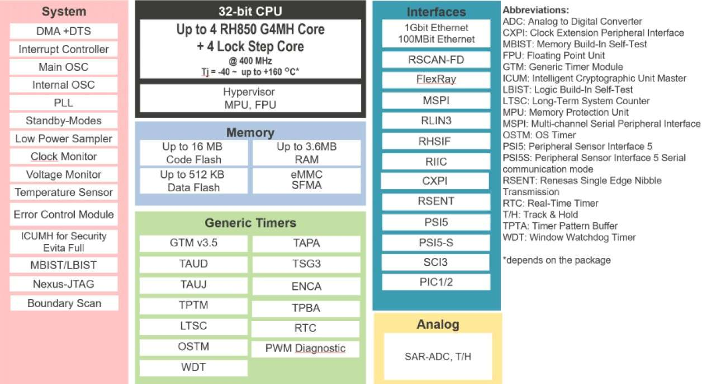

.. zephyr:board:: pb_rh850u2a_516pin

Overview
********

This product is a 32-bit single-chip microcontroller that incorporates multiple CPUs of the RH850
Series, code flash, data flash, RAM, DMA controllers, high-speed communication interfaces including
CAN, FlexRay, Ethernet, RHSIF, LIN, SENT, PSI5S, PSI5, peripheral functions including A/D
converters, timer units and many communication interfaces that are used in the automotive
applications. This product also conforms to the Automotive Safety Integrity Level (ASIL) that is highly
demanded in the recent automotive field (ASIL D level).

The key features of the RH850/U2A are as follows:

**RH850 multi-core CPU**

- This product contains multi G4MH (is understood as "G4MH2") cores. Each CPU supports RISC-type instruction
  sets and have significantly improved the instruction execution speed with basic instructions (one clock cycle
  per instruction) and the optimized 10-stage pipeline configurations. Furthermore, this product also
  supports multiplication instructions using a 32-bit hardware multiplier, saturated product-sum
  operation instructions, and bit manipulation instructions as instructions best suited for various fields. In
  addition, this product also support CPU virtualization function.
  Two-byte basic instructions and high-level language instructions improve object code efficiency for the
  C compiler and reduce the program size. Furthermore, this product is suited for advanced real-time
  control applications by offering a high-speed response time including the processing time of the onchip
  interrupt controller.

**On-Chip Code Flash and Data Flash**

- This product incorporates a 16-MB code flash allowing high-speed accesses, which enables each CPU to access
  this flash memory efficiently. This memory can be reprogrammed while it is placed on an application system.
  This can shorten the system development period and significantly improve the serviceability after the system
  is delivered. This product also has a 576-KB data flash that is available for storing EEPROM data.

**Rich peripheral functionality**

- This microcontroller supports common communication interfaces such as SPI, I2C as well as
  automotive-oriented communication interfaces such as Ethernet, RHSIF, FlexRay, CAN-FD,
  LIN, SENT and PSI5, PSI5S. As internal peripheral modules, this microcontroller incorporates A/D
  Converter, System Timer, Generic Timer Module, and a dedicated Peripheral Interconnection
  module which connects the functionalities of these peripherals. It also has the global standard on-chip
  Nexus JTAG as a debug interface. This allows construction of systems without the need to provide
  these functions externally, which reduces cost, quantity of components, and PCB footprint.

**Functional Safety support**

- This product equips several dedicated functionalities including the Dual Core Lock Step configuration
  for the CPU, the memory protection with ECC, the bus protection with ECC/EDC, the peripheral
  module protection, and voltage / clock monitors to support the functional safety standard (ISO26262)
  required in the automotive applications.

**Security support**

- This product provides various security features and utilizes the Intelligent Cryptographic Unit/Master
  (ICUMHA) as an on-chip Hardware Security Module (HSM).

Hardware
********
Detailed hardware features for the RH850/U2A MCU group can be found at `RH850 U2A Group User Manual Hardware`_

	RH850/U2A Block diagram (Credit: Renesas Electronics Corporation)

Detailed hardware features for the RH850/U2A MCU can be found at `RH850 U2A 516pin User Manual Piggy Board`_

Supported Features
==================

.. zephyr:board-supported-hw::

Programming and Debugging
*************************

.. zephyr:board-supported-runners::

Applications for the ``pb_rh850u2a_516pin`` board target configuration can be
built, flashed, and debugged in the usual way. The supported soc in
``pb_rh850u2a_516pin`` board is ``r7f702300aebbc-c``, ``r7f702300bebbc-c`` and ``r7f702300ebbg-c``.
See :ref:`build_an_application` and :ref:`application_run` for more details on
building and running.

**Note:** Currently, the pb_rh850u2a_516pin is built and programmed using the IAR for RH850 toolchain.
Please follow the steps below to program it onto the board:

  1. Download and install IAR toolchain:
     https://www.iar.com/embedded-development-tools/free-trials

  2. Set env variable:

   .. code-block:: console

      export ZEPHYR_TOOLCHAIN_VARIANT=iar
      export IAR_TOOLCHAIN_PATH=<Path/to/your/toolchain>/rh850

  3. Build the Blinky Sample for pb_rh850u2a_516pin

   .. code-block:: console

      cd ~/zephyrproject/zephyr
      west build -p always -b pb_rh850u2a_516pin/r7f702300bebbc-c samples/basic/blinky

Flashing
========

Program can be flashed to PB_RH850U2A_516PIN via 46-pin Aurora debug connector (e.g, for
using the Renesas standard emulator for RH850/U2A is the E2 emulator)

E2 emulator User's Manual at https://www.renesas.com/en/document/mat/e2-emulator-rte0t00020kce00000r-users-manual?r=488796

Driver are available at https://www.renesas.com/en/document/uid/usb-driver-renesas-mcu-toolse2e2-liteie850ie850apg-fp5-v27700for-32-bit-version-windows-os?r=488796

To flash a program to the board:

1. Connect to E2 emulator via 46-pin Aurora debug connector to host PC

2. Make sure 46-pin Aurora debug connector is in default configuration as
described in `RH850 U2A 516pin User Manual Piggy Board`_

3. Execute west command

   .. code-block:: console

      west flash -- --tool-opt="-auth id FFFFFFFFFFFFFFFFFFFFFFFFFFFFFFFFFFFFFFFFFFFFFFFFFFFFFFFFFFFFFFFF -osc 20"

Debugging
=========

You can use IAR Embedded Workbench for Renesas RH850 (`IAR Embedded Workbench Download`_) for a visual debug interface

Once downloaded and installed, open IarIdePm and configure the debug project
like so:

* Target Device: RH850 - R7F702300
* Driver: E2
* Power Supply: 5V
* Program File: <path/to/your/build/zephyr.elf>

**Note:** It's verified that we can debug OK on IAR Embedded Workbench for Renesas RH850 version 3.20.1 so please
use this or later version of IAR Embedded Workbench

References
**********
- `RH850 U2A Website`_
- `RH850 U2A MCU group Website`_
- `RH850 U2A Group User Manual Hardware`_
- `RH850 U2A 516pin User Manual Piggy Board`_
- `IAR Embedded Workbench Download`_

.. _RH850 U2A Website:
   https://www.renesas.com/en/products/rh850-u2a

.. _RH850 U2A MCU group Website:
   https://www.renesas.com/en/document/dst/rh850u2a-renesas-microcontroller-datasheet

.. _RH850 U2A Group User Manual Hardware:
   https://www.renesas.com/en/document/mah/rh850u2a-eva-group-users-manual-hardware-0

.. _RH850 U2A 516pin User Manual Piggy Board:
   https://www.renesas.com/en/document/mat/rh850u2a-516pin-users-manual-piggyback-board-y-rh850-u2a-516pin-pb-t1-v1

.. _IAR Embedded Workbench Download:
   https://www.iar.com/embedded-development-tools/free-trials
