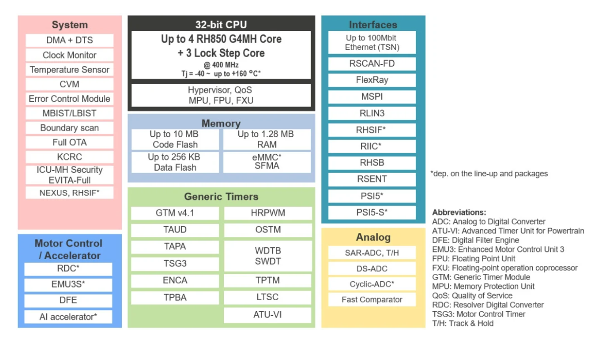

.. zephyr:board:: pb_u2b10_292pin

Overview
********

This RH850/U2B is a 32-bit single-chip microcontroller with multiple CPUs, Code Flash, Data Flash,
RAM modules, DMA controllers, A/D converters, timer units and many communication interfaces that
are used in the automotive applications. This microcontroller conforms to the Automotive Safety
Integrity Level (ASIL) that is highly demanded in the recent automotive field (ASIL D level).

The key features of the RH850/U2B are as follows:

**RH850 multi-core CPU**

- This microcontroller contains multi RH850G4MH2 cores support RISC-type instruction sets
  and have significantly improved the instruction execution speed with basic instructions (one
  clock cycle per instruction) and the optimized 10-stage pipeline configurations. Furthermore, this
  product also supports multiplication instructions using a 32-bit hardware multiplier, saturated
  product-sum operation instructions, and bit manipulation instructions as instructions best suited
  for various fields.In addition, this product also support CPU virtualization function.
  Two-byte basic instructions and high-level language instructions improve object code efficiency
  for the C compiler and reduce the program size. Furthermore, this product is suited for advanced
  real-time control applications by offering a high-speed response time including the processing
  time of the onchip interrupt controller.

**On-Chip Code Flash and Data Flash**

- This microcontroller has high-speed Code Flash from which CPU can fetch the instructions and
  the constant data. Code Flash with a capacity of up to 24MB can be reprogrammed when the chip
  is implemented in the application system.
  This chip also has Data Flash capable of EEPROM emulation with a capacity of up to 512 KB
  and up to 160 KB exclusively for ICUMHB.

**Rich peripheral functionality**

- This microcontroller supports common communication interfaces such as SPI as well as
  automotive-oriented communication interfaces such as Ethernet, RHSIF, FlexRay, CAN-FD,
  LIN, SENT and PSI5. As internal peripheral modules, this microcontroller incorporates A/D
  Converter, System Timer, Generic Timer Module, and a dedicated Peripheral Interconnection
  module which connects the functionalities of these peripherals.

**Functional Safety support**

- This microcontroller includes several dedicated functionalities such as Dual-Core Lockstep
  configuration for CPU, the memory protection with ECC/EDC on data and the address feedback
  mechanism, the bus protection with ECC/EDC on data and address, the peripheral module
  protection, and clock monitors to support the functional safety standard (ISO26262) required in
  the automotive applications.

**Security support**

- This microcontroller supports various security features. The Intelligent Cryptographic Unit -
  Master (ICUMHB) has a dedicated secure CPU (RH850 G3K) and some secure peripherals such
  as AES engines, a public key cryptography coprocessor, an engine that supports a HASH
  function based on SHA and Random Number Generator (RNG). This microcontroller also
  realizes the HW-level domain separation between non-secure and secure domains. The internal
  resources such as Code and Data Flash can be assigned to either a non-secure or secure domain,
  and the secure domain is protected against non-secure accesses by the HW mechanism. This
  microcontroller also has the protection scheme for debug and test functionality.

Hardware
********
Detailed hardware features for the RH850/U2B MCU group can be found at `RH850/U2B Group User's Manual Hardware`_

	RH850/U2B Block diagram (Credit: Renesas Electronics Corporation)

Detailed hardware features for the RH850/U2B MCU can be found at `RH850/U2B 292pin User's Manual Piggy Board`_

Supported Features
==================

.. zephyr:board-supported-hw::

Programming and Debugging
*************************

.. zephyr:board-supported-runners::

Applications for the ``pb_u2b10_292pin`` board target configuration can be
built, flashed, and debugged in the usual way. See
:ref:`build_an_application` and :ref:`application_run` for more details on
building and running.

Flashing
========

Program can be flashed to PB_U2B10_292PIN via 46-pin Aurora debug connector (e.g.., for
using the Renesas standard emulator for RH850/U2B is the E2 emulator)

E2 emulator User's Manual at https://www.renesas.com/en/document/mat/emulation-adapter-rh850u2b-users-manual?r=488796

E2 emulator's driver are available at https://www.renesas.com/en/document/uid/usb-driver-renesas-mcu-toolse2e2-liteie850ie850apg-fp5-v27700for-32-bit-version-windows-os?r=488796

To flash the program to board

1. Connect to E2 emulator via 46-pin Aurora debug connector to host PC

2. Make sure 46-pin Aurora debug connector is in default configuration as
describe in `RH850/U2B 292pin User's Manual Piggy Board`_

3. Using IAR Embedded Workbench for Renesas RH850 IDE to load external executable file.

	.. code-block:: console

Debugging
=========

You can use IAR Embedded Workbench for Renesas RH850 (`IAR Embedded Workbench Download`_) for a visual debug interface

Once downloaded and installed, open IarIdePm and configure the debug project
like so:

* Target Device: RH850 - R7F70255x
* Driver: E2
* Power Supply: 5V
* Program File: <path/to/your/build/zephyr.elf>

**Note:** It's verified that we can debug OK on IAR Embedded Workbench for Renesas RH850 version 3.20.1 so please
use this or later version of IAR Embedded Workbench

References
**********
- `RH850 U2B Website`_
- `RH850 U2B MCU group Website`_

.. _RH850 U2B Website:
   https://www.renesas.com/en/design-resources/boards-kits/y-rh850-u2b-292pin-pb-t1-v1

.. _RH850 U2B MCU group Website:
   https://www.renesas.com/en/products/rh850-u2b

.. _RH850/U2B Group User's Manual Hardware:
   https://www.renesas.com/en/document/mah/rh850u2b-hardware-users-manual-rev-120-r01uh0923ej0120?r=1539266

.. _RH850/U2B 292pin User's Manual Piggy Board:
   https://www.renesas.com/en/design-resources/boards-kits/y-rh850-u2b-292pin-pb-t1-v1

.. _IAR Embedded Workbench Download:
   https://www.iar.com/embedded-development-tools/free-trials
