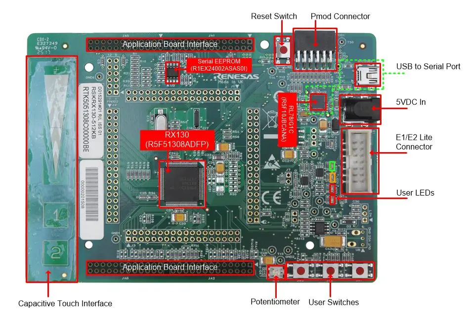
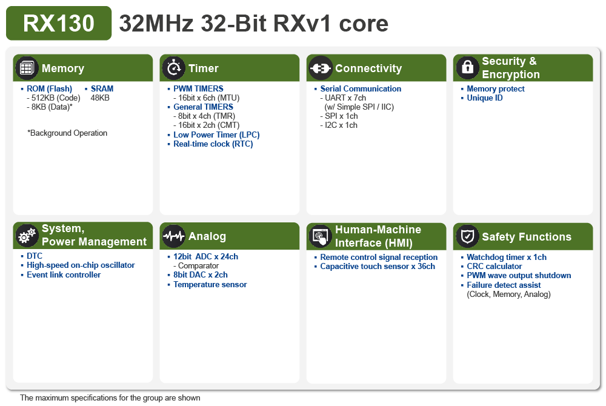

.. _rsk_rx130_512kb:

RX130_512KB Renesas Starter Kit
###############################

Overview
********

The Renesas Starter Kit for RX130-512KB is the perfect starter kit for
developers who are new to the RX130 (Program Flash 512KB, Pin Count 100-pin),
which operates at up to 32 MHz and is based on the RXv1 core architecture,
making it suitable for various embedded applications

**MCU Native Pin Access**

The RSKRX130-512KB includes:

- 32-MHz, 32-bit RX MCUs in 100 pins LFQFP package, Micon Pin Headers
- Direct MCU pin access through standard headers for easy peripheral integration
- Internal high-speed oscillator and low-speed on-chip oscillators
- Three low power consumption modes

**System Control and Debugging**

- USB Full-Speed Device (mini-B connector) for communication and power

- Power source options:

  - USB-powered (debug port)
  - External power supply via standard input

- Debugging support:

  - Via Jlink debugger with RX adapter boards.

- User LEDs and buttons:

  - Four User LEDs (red x2, yellow, green)
  - Power LED (green) indicating availability of regulated power
  - One Reset button, three User buttons

- Ecosystems expansions:

  - Two Digilent Pmod (LCD and Spare) connectors
  - 2Kbit I2C EEPROM

**Special Feature Access**

- IEC60730 compliance
- Capacitive touch sensing unit
- LCD drive capability for displaying data or status in real-time applications

	RSKRX130-512KB Board Functional Area Definitions
	(Credit: Renesas Electronics Corporation)

Hardware
********
Detailed hardware feature for the RX130 MCU group can be found at `RX130 Group User's Manual Hardware`_

	RX130 Block diagram (Credit: Renesas Electronics Corporation)

Detailed hardware feature for the RSKRX130-512KB MCU can be found at `RSK_RX130_512KB - User's Manual`_

Supported Features
==================

The below features are currently supported on Zephyr OS for RSKRX130-512KB board:

+-----------+------------+----------------------+
| Interface | Controller | Driver/Component     |
+===========+============+======================+
| GPIO      | on-chip    | gpio                 |
+-----------+------------+----------------------+
| ICU       | on-chip    | interrupt controller |
+-----------+------------+----------------------+
| UART      | on-chip    | serial               |
+-----------+------------+----------------------+
| CLOCK     | on-chip    | clock control        |
+-----------+------------+----------------------+

Other hardware features are currently not supported by the port.

Programming and Debugging
*************************
Applications for the ``rsk_rx130_512kb`` board target configuration can be
built, flashed, and debugged as below.

Getting started:
About ``Install dependencies`` and ``Get Zephyr and install Python dependencies``,
please visit `Zephyr Getting Started`_ to install dependencies.

For RX MCU build on Zephyr, currently Zephyr SDK is not supported we need to install
GCC for RX tool chain separately:

  - Download and install GCC for RX v8.3.0.202405 toolchain:

    https://llvm-gcc-renesas.com/rx-download-toolchains/

  - Set env variable:

	.. code-block:: bash
		$ export RXGCC_TOOLCHAIN_PATH=<Path into your installed tool chain>
		$ export ZEPHYR_TOOLCHAIN_VARIANT=rxgcc

  - Build the Blinky Sample:

	.. code-block:: bash
		$ cd ~/zephyrproject/zephyr
		$ west build -p always -b <your-board-name> samples/basic/blinky

Flashing
========

Program can be flashed to RSKRX130-512KB via Jlink with RX adapter boards.

To flash the program to board

  1. Connect from board's debug connector port to host PC using Jlink debugger.

  2. Execute west command

	.. code-block:: console

		west flash

Debugging
=========

You can use `Renesas Debug extension`_ on Visual Studio code for a visual debug interface.
The configuration for launch.json is as below.

.. code-block:: json
  {
    "version": "0.2.0",
    "configurations": [
        {
            "type": "renesas-hardware",
            "request": "launch",
            "name": "Renesas GDB Hardware Debugging",
            "target": {
                "deviceFamily": "RX",
                "device": "R5F51308",
                "debuggerType": "SEGGERJLINKRX",
        }
    ]
  }

References
**********
- `RSK_RX130_512KB Website`_
- `RX130 MCU group Website`_

.. _RSK_RX130_512KB Website:
   https://www.renesas.com/en/products/microcontrollers-microprocessors/rx-32-bit-performance-efficiency-mcus/rx130-512kb-starter-kit-renesas-starter-kit-rx130-512kb

.. _RX130 MCU group Website:
   https://www.renesas.com/en/products/microcontrollers-microprocessors/rx-32-bit-performance-efficiency-mcus/rx130-cost-optimized-high-performance-32-bit-microcontroller-enhanced-touch-key-function-and-5v-operation

.. _RSK_RX130_512KB - User's Manual:
   https://www.renesas.com/en/document/mat/renesas-starter-kit-rx130-512kb-users-manual-rev100

.. _RX130 Group User's Manual Hardware:
   https://www.renesas.com/en/document/mah/rx130-group-users-manual-hardware-rev300

.. _Renesas Debug extension:
   https://marketplace.visualstudio.com/items?itemName=RenesasElectronicsCorporation.renesas-debug

.. _Zephyr Getting Started:
   https://docs.zephyrproject.org/latest/develop/getting_started/index.html
