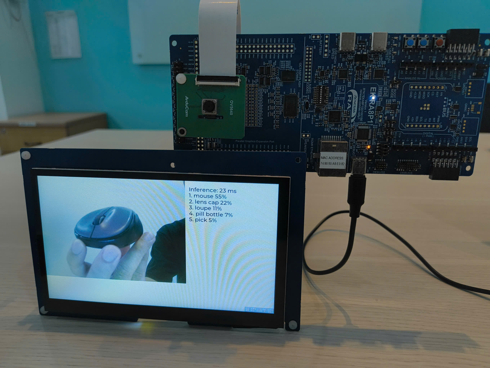
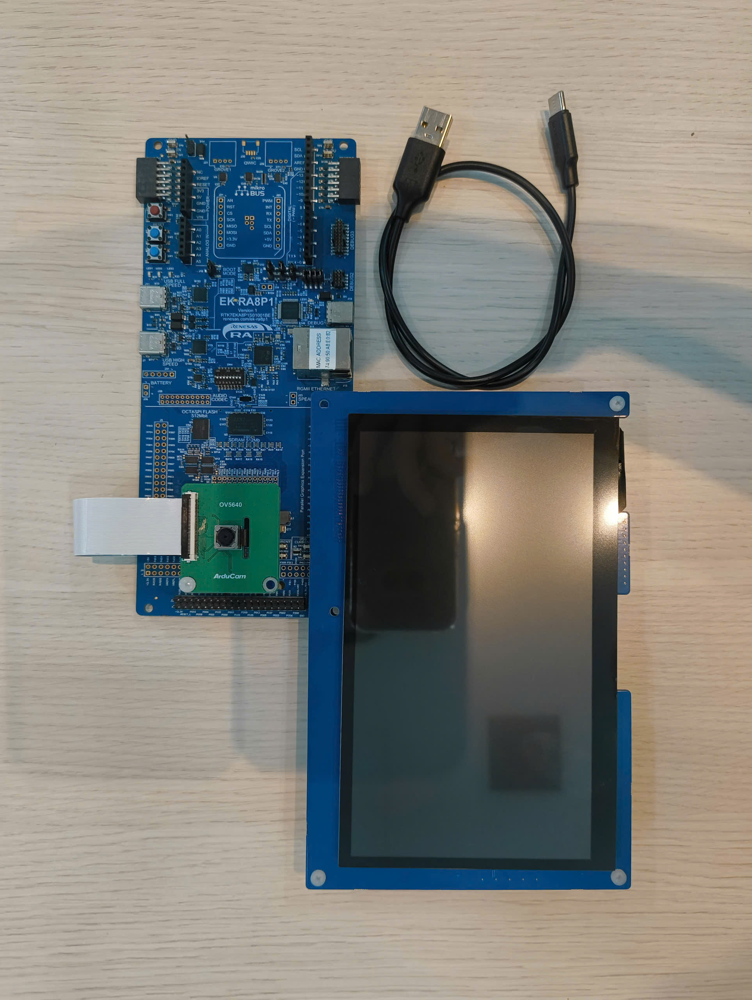
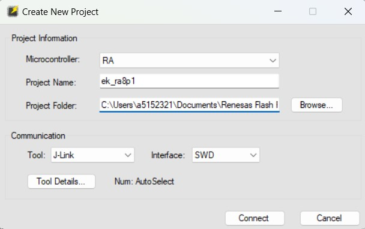
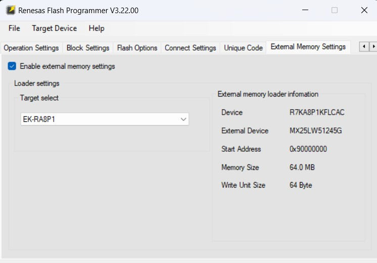
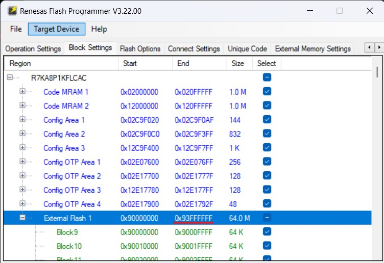
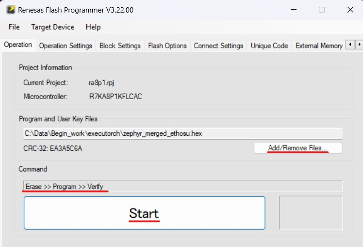

# MobileNetV2 Live Camera Classification (Renesas EK-RA8P1)

Captures live OV5640 camera frames, classifies them with MobileNetV2 on the
Ethos-U55 NPU via ExecuTorch, and shows the camera feed plus the top-5
labels (1000-class ImageNet) on the parallel RGB LCD.

**App version: v1.2** (matches the prebuilt images in [Prebuilt demo](#prebuilt-demo)).



## Supported hardware and model

| Item | Value |
|---|---|
| Board | Renesas EK-RA8P1 (`ek_ra8p1/r7ka8p1kflcac/cm85`) |
| Camera | Arducam CU450 (OV5640, MIPI-CSI), shield `arducam_cu450_ov5640_mipi_csi` |
| LCD | Renesas parallel RGB LCD, 1024x600, shield `rtklcdpar1s00001be` |
| Model | MobileNetV2 alpha 0.5 (`mv2_a05`), INT8, 224x224 input, 1000 ImageNet classes |



## Prebuilt demo

Prebuilt merged images are in [binary/](binary/). Flash them as described in
[Flashing](#flashing). Never flash an unmerged image.

| Image | Runs on | Version | SHA-256 |
|---|---|---|---|
| `zephyr_merged_ethosu.hex` | Ethos-U55 NPU | v1.2 | 0abb1e83237dbdbd4f0aef8055df7ab5e4ece087ee08827d553fdc1731e89edf |

Check the file before flashing, e.g. `sha256sum binary/zephyr_merged_ethosu.hex`.

Per-frame console logging (`CONFIG_APP_RUNTIME_LOG`) is off by default and
must stay off for demos: every log line is a synchronous console write and it
makes the video choppy.

## Prerequisites

- Python 3.12 or newer (tested with 3.12.3) for the export scripts.
- A west workspace for this project (see [Manifest / build](#manifest--build)).

All commands below run from the `zephyr/` directory of the workspace.

## Prepare a PTE model file

A prebuilt `.pte` is in [models/](models/); skip this section to use it.
Re-export only to change the model or the calibration.

### Generate calibration data (recommended)

Without `--calibration_data`, quantization calibrates against a
`torch.randn(1,3,224,224)` example input, i.e. random noise, not anything
resembling a real camera frame. The PTQ observers then pick scale/zero-point
values matched to noise statistics (~N(0,1)) instead of the actual runtime
input range (`(uint8-128)/128`, i.e. [-1,1)), which starves the INT8
quantization of precision on real images and produces classifications that
don't track what's actually in frame. Fix: calibrate on real photos,
preprocessed exactly like the on-device pipeline:

```
python samples/boards/renesas/mv2-ethosu-renesas/scripts/gen_calibration_data.py \
    --input <folder of real photos (.jpg/.png/...)> \
    --output calib_data/
```
A few dozen to a few hundred varied photos (different objects/scenes) is
enough - no labels needed, calibration is unsupervised (it only records
activation ranges, never checks predictions against ground truth).

### Export

```
python samples/boards/renesas/mv2-ethosu-renesas/scripts/export_quantized_io.py \
    --model_name=mv2_a05 --quantize --delegate --target=ethos-u55-256 \
    --calibration_data calib_data/ \
    --output=samples/boards/renesas/mv2-ethosu-renesas/models/mv2_a05_u55_256_int8.pte
```

`--model_name` options:
- `mv2_a05` (recommended) - pretrained MobileNetV2 alpha=0.5 (timm's
  `mobilenetv2_050`; torchvision ships no ImageNet checkpoint for this
  width). Handled directly in `export_quantized_io.py`, not registered in
  executorch's `examples/models`.
- `mv2` - pretrained full-width MobileNetV2 (torchvision).
- `mv2_untrained` - random weights, meaningless classifications; don't use.

Copy the printed `scale`/`zero_point` values into the board `.conf`'s
`CONFIG_AI_INPUT_QUANT_SCALE`/`ZERO_POINT` and
`CONFIG_AI_OUTPUT_QUANT_SCALE`/`ZERO_POINT` after every re-export - the
runtime can't read them back from the `.pte`, and output's values aren't
stable across export runs.

E.g.

```
...
Delegation summary:
  Model was partially delegated.
  Delegated partitions for silicon acceleration: 1
  Non-delegated ops: 1
  Non-delegated operators:
    - getitem: 1
Quantized input 0 in place of the boundary quantize op. scale=0.007808685302734375, zero_point=0, clamped to [-128, 127] (scalar_type_enum=torch.int8).
Quantized output 0 in place of the boundary dequantize op. scale=0.10048583149909973, zero_point=127, clamped to [-128, 127] (scalar_type_enum=torch.int8).
PTE file saved as mv2_a05_u55_256_int8.pte
```

```
# USER NEED UPDATE AFTER EACH TIME EXPORT MODEL
CONFIG_AI_INPUT_QUANT_SCALE="0.007808685302734375"
CONFIG_AI_INPUT_QUANT_ZERO_POINT=0
CONFIG_AI_OUTPUT_QUANT_SCALE="0.10048583149909973"
CONFIG_AI_OUTPUT_QUANT_ZERO_POINT=127
```

The board `.conf` ships with the values above, which match the prebuilt
`models/mv2_a05_u55_256_int8.pte`.

## Manifest / build

```
west config manifest.project-filter -- '-.*,+zephyr,+executorch,+cmsis,+cmsis_6,+cmsis-nn,+hal_ethos_u,+hal_renesas,+lvgl'
west update
west blobs fetch hal_renesas
```

`west blobs fetch hal_renesas` downloads the Dave2D library
(`libdave2d.a`) used for GPU acceleration; without it the build fails.
The checkout folder can have any name (e.g. `renesas-zephyr`).

```
west build -b ek_ra8p1/r7ka8p1kflcac/cm85 samples/boards/renesas/mv2-ethosu-renesas \
    --shield rtklcdpar1s00001be --shield arducam_cu450_ov5640_mipi_csi -- \
    -DET_PTE_FILE_PATH=samples/boards/renesas/mv2-ethosu-renesas/models/mv2_a05_u55_256_int8.pte
```

The merged image to flash is `build/zephyr/zephyr_merged.hex`.

## Flashing

> **Warning:** flash only `zephyr_merged.hex` (or a prebuilt
> `zephyr_merged_*.hex`), never the plain `zephyr.hex`.
> The model section lives in OSPI flash and the board's OSPI controller reads
> bytes back in swapped order in 8D-8D-8D mode, so the `split_flash` CMake
> target (see `CMakeLists.txt`) byte-swaps just that section and remerges it
> into `zephyr_merged.hex`. Flashing `zephyr.hex` leaves the model data
> scrambled at runtime.

`zephyr_merged.hex` covers both the internal flash and the external OSPI
flash, so the programming tool must be set up for external flash on the
EK-RA8P1.

### Renesas Flash Programmer (GUI, Windows)

Program `zephyr_merged.hex` with external flash enabled (EK-RA8P1 external
loader), as in the screenshots below.









### Other files

`build/zephyr/zephyr_internal.hex` is the same image with the model section
removed. Use it to flash or debug only the internal flash while the model is programmed to
OSPI separately.

## Latency profiling

Build with `-DCONFIG_APP_PROFILING=y` (and leave `CONFIG_APP_RUNTIME_LOG` off).
Every `CONFIG_APP_PROFILING_PERIOD` results (default 30) the console shows
avg/max per stage in ms:

- **preprocess total**: `camera_task` dequeues the frame -> just before
  `Method::execute()`. Split into crop/resize/RGB565->RGB888, the quantize LUT,
  and queue waits (the converted frame waits for the previous inference).
- **inference**: `Method::execute()`.
- **postprocess total**: `execute()` returned -> the result is on screen
  (LVGL flush finished and the GLCDC vsync passed). Split into
  `get_outputs()` + top-k, and queue + render + flush.
- **end-to-end**: capture -> the classification of that frame is on screen.
- **video latency**: capture -> that camera frame itself is on screen.

"Capture" is the VIN dequeue, i.e. the end of the frame readout; sensor exposure
and readout time are not included. Only frames that reach the NPU are counted
for the first five metrics (the AI path drops frames while busy).

## Notes

- Dave2D GPU acceleration is enabled (see the board `.conf`'s
  `CONFIG_LV_USE_DRAW_DAVE2D` block) for LVGL's full-panel compositing.
- The camera's video buffer pool and the LVGL display buffer (VDB) are
  routed to external SDRAM (`CONFIG_VIDEO_BUFFER_POOL_ZEPHYR_REGION`,
  `CONFIG_LV_Z_VDB_ZEPHYR_REGION`) - on-chip SRAM alone can't hold them
  alongside everything else. The ExecuTorch method/temp allocator pools
  stay in on-chip RAM (`.bss.method_pool`/`.bss.tensor_arena`, see
  `ai_processing.cpp`).
- `pool_section.ld.in` places the Dave2D (DRW) heap in on-chip RAM instead
  of DTCM, because DTCM does not have enough space for it. All other
  `.noinit` data still goes to DTCM.
- The board overlay reclaims the CM33 core's flash/SRAM share for this
  single-core app.
